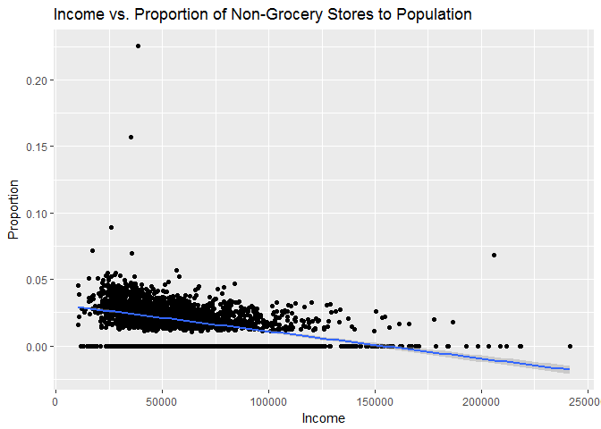

MATH 216 Data Science Final Project (Fall 2016)
================

-   Name: Brenda Li
-   Project title: A Look at Food Accessibility in LA County
-   Write-up on RPubs: <http://rpubs.com/brendali121/Final>
-   Abstract: According to the [USDA](http://www.fns.usda.gov/tags/food-desert-locator), about 13.5 million people in the United States reside in urban communities with limited access to affordable or good-quality fresh food. These regions, coined as ["food deserts"](https://en.wikipedia.org/wiki/Food_desert), are usually inhabited by lower-income populations and have become of increasing interest to researchers and policy makers since the populations that reside in these regions are also the populations that exhibit high levels of obesity, diabetes, and other health conditions linked to unhealthy diets. In this project, I sought to examine the relationship between household income and food accessibility; in particular, I looked at food accessibility within census tracts of LA County, and attempted to reproduce previous results demonstrating a strong correlation between socioeconomic status and access to healthy foods.

